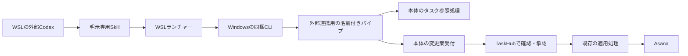

# 外部CodexからTaskHubを利用するための設計案

- 状態: 提案。実装・設定変更は未着手であり、既存の要件を変更する文書ではない。
- 調査日: 2026年9月8日 JST
- 対象: 手元のリポジトリの `22a47d1a6a93614942697b0caed979dcc93e2c29`。2026年9月7日のコミット。
- 対象環境: Windowsで起動中のTaskHubと、同じPCのWSLで動く外部Codex CLI。

## 目的と推奨案

通常のCodexセッションで `$taskhub` を明示したときに、TaskHubのタスクを参照し、会話を基に新規タスクの追加案を提出できるようにする。TaskHub内のAIセッションを開始する必要はなく、毎回の接続設定の切り替えも不要にする。

推奨する構成は、明示呼び出し専用Skill、アプリ同梱CLI、WindowsのローカルIPC、本体の共通処理を順につなぐ方式である。判断は「理由があってそうすべき」。明示呼び出し、本体との同時更新、既存処理の再利用を満たせるためである。



初期対応は一覧・詳細の参照と、独立した新規タスクの追加案に絞る。外部からの完了・取り下げ・分割・依存関係変更は後続の拡張とする。これらは追加とは異なる根拠確認を必要とするため、初期対応から外す判断は「理由があってそうすべき」である。

GUIでの承認は、現行要件を維持する限り「理由があって必須」。追加案の提出後は「TaskHubで承認待ち」と返し、適用結果を確認するまで「登録済み」と報告しない。外部CLIに承認操作やAsanaへの直接書き込み操作は設けない。

## 現行コードから再利用する部分

TaskHubの正本はAsanaであり、SQLiteは再構築可能なキャッシュとして使う。タスクはセクション・タグとCustom external dataで表現し、順位は本体で計算する。外部からも本体を通すことで、このデータモデル、同期、検証、承認を共有する。

| 現行の処理                             | 調査した箇所                                                                              | 設計への反映                                                              |
| -------------------------------------- | ----------------------------------------------------------------------------------------- | ------------------------------------------------------------------------- |
| 正本・承認・未承認案・オフラインの方針 | `docs/requirements_and_design.md:17`                                                      | 外部経路でも承認後の反映、未承認案のメモリ保持を維持する                  |
| タスク一覧・詳細                       | `src/main/read-model/service.ts:961`                                                      | `getOverview` と `getTaskDetail` を再利用する                             |
| GUIの一覧フィルター                    | `src/renderer/src/state.ts:549`                                                           | `filterTaskRows` の純粋な判定を共有し、mainからRenderer全体をimportしない |
| 内部AIの読み取りIPC                    | `src/main/codex/taskctl/broker.ts:477`、`src/main/codex/session/session.ts:832`           | 通信機構を再利用し、セッション寿命のbrokerは外部公開しない                |
| ランチャー・Skill生成                  | `src/main/codex/taskctl/client-script.ts`、`src/main/codex/workspace/initializer.ts:181`  | アプリ側で資源を生成・置き換える方式を外部管理先にも使う                  |
| 提案の基本検証                         | `src/main/ai/proposal-validation/basic.ts:1204`                                           | 外部の狭い入力を本体のcreate操作へ変換し、既存検証器に渡す                |
| 承認入力の準備                         | `src/main/application/service.ts:3653`                                                    | AIセッションの基準値ストアへの依存を分離して共有する                      |
| 承認・適用の境界                       | `src/main/ai/workflow/service.ts:2530`、`src/main/application/service.ts:4350`、同`:4780` | オンライン再取得、基準照合、キュー所有、適用中状態、結果反映を共通化する  |
| 適用と読み戻し                         | `src/main/ai/proposal-application/coordinator.ts:1182`、`operation-writer.ts:853`         | 既存のUUID、Asana書き込み、読み戻し、順位更新を使う                       |
| 適用の復旧記録                         | `src/main/storage/application-journal.ts:13`、`src/main/application/service.ts:3094`      | 既存記録は使えるが、外部要求IDとの対応は現状保存されない                  |
| 提案UI                                 | `src/renderer/src/AiPanel.vue:1064`、`src/renderer/src/App.vue:2433`                      | 表示部品を共有し、`session_id` 必須の操作窓口から外部の窓口を分ける       |

提示案にあるAIワークフロー全体の共通サービス化は、初期対応の前提にしない。既存の検証器、適用coordinator、writer、journalは既に分かれている。一方で、`prepareApprovalInput` は `AiSessionBaselineStore` に依存し、適用中状態と診断更新の処理は `createAiWorkflow` 内にある。その部分を共通化せずcoordinatorだけを直接呼ぶと、既存の整合性境界を迂回する。

初期対応では、外部の追加案受付と保持を新設し、基準値の保持・承認入力の準備・適用の実行境界を必要な範囲だけ分離する。汎用的な提案選択、分割、会話、根拠収集まで一括で移さない。この共通化範囲の判断は「理由があってそうすべき」であり、実際に共有する処理の重複を防ぎながら、既存AIへの変更範囲を抑えられる。

外部案の基準値は外部受付サービスが保持する。共通の承認準備には提案ID、確認時の基準スナップショットとCustom external dataを明示して渡す。外部案を `AiSessionBaselineStore` や `AiWorkflowService` に登録する形にはせず、内部AIのアダプターも同じ承認準備へ必要な値を渡す。

## 利用体験と公開する操作

利用者は初回だけ連携を登録する。その後はTaskHubを起動した状態で、通常のCodexから `$taskhub 今着手できるタスクを5件教えて` や `$taskhub この不具合の修正をタスクに追加して` と依頼する。

Skillは、呼び出すたびに稼働中の本体から操作仕様を取得する。TaskHubの認証情報、全タスク、Asanaへの変換規則をSkillに埋め込まない。普段のコーディングで説明を提示しないことと、取得した情報が会話履歴に残ることは別の性質として扱う。

Codex向けの `agents/openai.yaml` は次の設定にする。公式仕様で確認できるのは、暗黙起動を止めても明示呼び出しが残ること。モデルへのメタデータ提示やアクセス権全体を制御する保証としては扱わず、通常セッションでの表示・動作は対象のCodexで確認する。[R1]

```yaml
policy:
  allow_implicit_invocation: false
```

明示呼び出しの要件は、通常の会話でSkillを自発的に選ばせない利用体験として設計する。この設定はアクセス権の強制機構ではない。同じユーザー権限のシェルからCLIを直接実行することまで禁止するものではない。

以下の操作名は新設する公開契約の案であり、現在存在するコマンドではない。

| 操作               | 入力と結果                                                                                                             |
| ------------------ | ---------------------------------------------------------------------------------------------------------------------- |
| `agent-info`       | 本体の版、プロトコルの版、起動インスタンス、接続先の文脈、現在時刻・タイムゾーン、利用可能な操作、入力形式、制約を返す |
| `tasks.list`       | 表示対象・検索条件・件数上限を受け、本体で絞り込みと順位付けをした一覧を返す                                           |
| `tasks.get`        | TaskHubが管理する対象タスクの詳細を返す                                                                                |
| `proposals.create` | 独立した新規タスク一件の追加案を検証してメモリに保持し、提案ID・操作IDと承認待ち状態を返す                             |
| `proposals.status` | 提案の状態と、確認できた適用結果を返す                                                                                 |
| `review.open`      | 指定の提案をTaskHubで開く。承認は行わない                                                                              |

CLIの固定した呼び出し口は `agent-info` と `request` にする。後者は上表の操作名と入力を標準入力のJSONとして渡す。ユーザー由来の文章をシェルのコマンド文字列へ埋め込まない。標準出力は構造化した応答、診断は標準エラーに分け、失敗時は非ゼロの終了コードを返す。

外部操作の入力は本体でZod検証する。CLIへ業務規則を複製せず、本体の検証を最終判断とする。公開するスキーマはJSONで表現可能な構造に限定し、業務上の検証結果も本体から返す。現行コードにもZod 4の `z.toJSONSchema` の利用があるが、提案スキーマの `superRefine` までJSON Schemaに置き換わるとは扱わない。

追加案の入力は、タイトルを必須とし、説明、未着手または着手中の初期状態、重要度、既存の領域、期限を任意に指定できるようにする。これらは既存の独立タスク作成で扱える値である。指定がない場合の重要度3・領域「未分類」などは本体の既存規則に従い、承認画面に実際の作成内容を表示する。親、依存先、完了根拠、任意のAsana属性は受け付けない。

既存の提案契約が要求する提案理由 `reason` と確信度 `confidence` も必須入力とし、外部エージェントの申告値として保持する。本体は既定値を補わない。`basis` は初期対応では `inferred` として構成する。提案ID、操作ID、基準ハッシュ、根拠参照は本体が付け、外部提案を信頼済みの利用者指示へ昇格させない。受信時とGUI編集後に同じ提案検証を行う。

期限は、そのタスク自身の確定した期限だけを構造化するようSkillに指示する。「この修正は金曜まで」は期限の候補になるが、「関連する製品の発売が金曜」「担当者が金曜なら対応できるかもしれない」は、そのまま修正タスクの期限にしない。不確かな内容は説明へ残す。外部モデルの意味判断を本体が証明できるわけではないため、出所と内容はGUIで確認する。

一覧には同期時刻と同期状態を含める。`getOverview` の順位情報と、アプリの同期runtimeの状態を組み合わせて返す。同期済みキャッシュがなければ利用不可を返し、オフラインでキャッシュがあればその時刻を明示して閲覧だけを許可する。追加案をオンライン復帰待ちの変更キューとして受け付けない。順位や着手可能性を外部Codexに再計算させない。

読み取りのたびに同期を暗黙に実行しない。既存の同期には整合修復の書き込みも含まれるためである。通常一覧はGUIと同じranked対象を本体で絞り、件数上限を適用して必要な列だけ返す。同期時刻を一意なスナップショットIDとは扱わず、追加案の基準値は本体が受付時に保持する。

## WindowsとWSLの接続

WSLからWindowsの実行ファイルを起動し、名前付きパイプにはWindows側のプロセスから接続する。WSLのLinux版Node.jsからWindowsのパイプへ直接接続する設計にはしない。

最初に確認する実行方式は、既存の `ELECTRON_RUN_AS_NODE=1` を用いたElectronランタイムの再利用である。WSLからの環境変数の受け渡しには `WSLENV` を使い、既存の項目を保持してWindows向けの伝播を指定する。WSLが起動するEXEのパスを `wslpath -u` で変換し、WindowsのElectronへ渡すクライアントスクリプトのパスはWindows形式を使う。入力JSONは標準入力でそのまま渡す。

WindowsのEXEの直接実行と標準入出力の接続、`WSLENV` による環境変数の伝播はMicrosoftの公式機能である。[R7][R8] この構成では、WSLとWindowsの間にTCP接続を必要としない。WSL2のNATとmirrored networkingの違いを、TaskHubとの通信条件から外せる。一方、WSLのWindows実行ファイル相互運用が有効であることは必要になる。

VS CodeのWindows向け `code.sh` にも、`WSLENV`、Windows形式へのスクリプトパス変換、Electronの直接起動、終了コードの伝播がある。この経路は既存アプリの実装にも使われている。[R11]

配布版での標準入出力と終了コード、Electronの `runAsNode` fuse、実際のCodexの権限設定は実機で確認する。`runAsNode` を無効にするとこの起動方式は使えない。[R9] 通常のWSLターミナルで動いたことだけを、Codexから実行できる証拠にはしない。この確認は「理由があって必須」であり、通る前にWindows＋WSL対応済みとは扱わない。

## 本体の更新と連携部品の更新

Skillは本体が提供する仕様を取得する小さな入口にし、CLIとともにTaskHubのリリースへ同梱する。WSL側にアプリの版ごとの実装をコピーし続けない。

本体の自動更新、連携ファイルの更新、CodexによるSkillの再読み込みは、別の処理として扱う。本設計の対象は、本体を更新して起動した後に連携部品が追従すること。TaskHub本体の自動ダウンロード・インストールは別の機能である。

| 契機                 | 動作                                                               |
| -------------------- | ------------------------------------------------------------------ |
| 初回登録             | Windowsの管理フォルダーを作り、対象WSLのSkill配置先から参照する    |
| TaskHub起動          | 同梱資源と実行先を公開し、外部連携用入口を起動する                 |
| 本体更新後の起動     | 管理対象のSkillとランチャーを更新する                              |
| Skill呼び出し        | 稼働中の本体へ `agent-info` を要求し、現在の操作仕様を取得する     |
| プロトコル不一致     | 推測した形式で実行せず、再呼び出しまたは登録修復が必要なことを返す |
| 管理フォルダーの移動 | 対象WSLへの登録を修復する                                          |

本体のインストール先と、WSLが参照する管理フォルダーを分ける。管理フォルダーが維持される通常更新や実行ファイルの移動では、本体が現在の実行先を更新する。別のインストールが既存の登録を黙って奪わないよう、登録先を識別する。

管理先は `app.getPath('userData')/external-agent` とする。その下の `skill/` に `SKILL.md`、`agents/openai.yaml`、`scripts/taskhub` を置き、クライアント本体と接続情報はSkillの外に置く。接続情報やcapabilityをSkill本文や `agent-info` に含めない。

初回はTaskHubの連携設定から、対象WSLで実行する登録手順を表示する。登録処理はそのWSLの `~/.agents/skills/taskhub` からWindows管理下の `skill/` へのシンボリックリンクを作る。既存の同名Skillがある場合は上書きせず競合を示す。Windowsアプリから全WSLディストリビューションのホームを書き換えない。連携の有効化は保存し、毎回の切り替えを不要にする。

Skillはランチャーを `bash` で実行するため、Windows側ファイルの実行権限ビットに依存しない。ランチャーには、そのTaskHub起動時点の `process.execPath` とクライアントスクリプトのWindows絶対パスを適切に引用して記録する。要求文の実行や `eval` は行わない。PATH探索やアプリのインストール先の走査も不要になる。

WSLが読む生成ファイルはUTF-8、BOMなし、LFで書き出す。日本語・空白・引用符を含むパスと既存の `WSLENV` を検証し、WindowsとLinuxの両方の引用・文字コードを実機で確認する。

更新するのはアプリの単一起動制御で選ばれた主プロセスだけとする。クライアントとランチャーを一時ファイルから置き換えた後にパイプを待受し、最後に接続情報を公開する。各ファイルの置き換えだけで全体の版の一致を保証せず、接続時にプロトコルと起動インスタンスを検証する。更新途中や起動失敗時には外部連携を利用不可とし、古い接続先へ処理を流さない。

複数の配布物が同じアプリデータを使う場合は、起動中の主プロセスを対象とする。別のアプリデータや別チャンネルは別の登録先として扱う。本体停止中にランチャーが残っていても、別のTaskHubを探索・自動起動せず接続不能を返す。

CodexがSkillを即時に再読み込みすることだけには依存しない。既に会話へ読み込まれた説明が残っていても、呼び出すたびに本体へ仕様を問い合わせ、本体で入力を検証する。将来、入口そのものの契約を変更した場合は登録修復の対象とし、古い形式を救済する分岐を増やさない。

公式には `~/.agents/skills` でユーザー単位のSkillを探索でき、Skillフォルダーのシンボリックリンクも扱える。Skillの変更を自動検知する一方、反映されない場合にはCodexの再起動が案内されている。Windows側の更新を実行中のWSL上のCodexへ即時反映する保証はない。[R1]

## 受付・承認・再送の整合性

外部連携用入口は、内部AIセッション用の `taskctl` とは別の寿命と権限を持たせる。アプリ起動中の外部要求が、内部AIのスナップショットやセッション終了に巻き込まれないようにする。

再利用するのは名前付きパイプ、capability照合、入力・出力の制限、接続情報の置き換えなどの仕組みである。接続用capabilityは内部AI用と分け、Windows側のクライアントだけが扱う。公開操作は列挙し、Renderer向けIPCを任意に中継しない。

現行コードの `current_user` はWindowsのアクセス権を検証済みという意味ではない。`broker.ts` の所有者確認は `process.getuid` がないWindowsでは行われず、Unix向けのモード確認も省略される。`readableAll: false` と `writableAll: false` を指定していることだけで、Windowsのユーザー専用ACLが保証されたとは扱わない。外部入口では管理ファイルのユーザー専用アクセス権を設定・検証し、パイプの実際のアクセス権と認証拒否を確認する。既存の境界名をそのまま保証として流用しない。

外部から受け取った説明文を、TaskHubが直接受け取った利用者の発言として扱わない。外部入力はあくまで外部AIからの提案であり、本体で作った基準と現在状態に対して検証する。既存の `external_tool` 根拠には本体が発行した外部要求の参照を付け、外部由来であることを保持する。利用者の原文を受け取ったことや、完了の信頼済み根拠を得たことにはしない。

外部側は送信前に要求IDを生成し、`agent-info` で得た起動インスタンスと接続先の文脈、入力内容とともに保持する。本体は文脈の一致を確認し、内容のダイジェストを計算して受け付ける。同じ起動中の同じID・同じ内容の再送には同じ提案を返し、内容が違うID再利用は拒否する。重複受付の確認と提案登録は一つの直列化された処理で行う。

要求ID、提案ID、適用操作IDは役割を分ける。未承認案を却下・適用しても、同じ起動中にその要求IDから別の案を作らないよう受付結果を保持する。保持件数と入力サイズに上限を設け、上限に達したら新規受付を拒否する。古いIDを黙って捨てて再作成可能にしない。

| 状況                                     | 扱い                                                                     |
| ---------------------------------------- | ------------------------------------------------------------------------ |
| 受付後に応答が途切れた                   | 同じ要求IDで照会・再送し、別の提案を作らない                             |
| GUIで承認待ち                            | 未承認案をメモリに保持する。外部CLIから承認しない                        |
| 承認前に対象の文脈が変わった             | 別のAsana接続先へ転送せず、失効または見直し対象とする                    |
| 承認後、書き込みと読み戻しの間で失敗した | 未登録扱いで作成し直さず、既存の適用記録に沿って確認する                 |
| アプリが再起動した                       | 未承認案は復元しない。古いインスタンスの要求を新規作成として再受付しない |
| 再起動前に適用されたか確認できない       | 結果不明と返す。失効したことだけを理由に未登録と報告しない               |

再起動後の照会は、既知の提案IDと操作IDがあれば適用journalに記録された段階と結果を読める。ただし、それだけでAsanaの実際の結果を確定できるとは限らない。現在のjournalには要求ID・内容のダイジェスト・未承認案本体がなく、起動時の文脈なしの復旧も結果不明を返し得る。受付応答を失い要求IDだけを知っている場合は、再起動後に元の案を確実には特定できない。初期対応では結果不明を返し、再提出前にTaskHubで確認する。未承認案の永続化や、再起動をまたいだ受付台帳は追加しない。

GUIからの承認は既存のアプリ全体の適用キューを通す。同期、GUI編集、内部AIの承認と同じ状態を変更するため、外部入口からwriterを直接呼ばない。待機後にも接続先と適用条件を確認し、利用者が確認した基準を黙って差し替えない。

外部適用をキューの新しい種別として追加し、`AsanaOperationQueue.invalidatePendingMutations` の失効対象にも含める。現在の失効対象は種別を列挙しているため、キューへの追加だけでは再認証や文脈変更時の取消に追従しない。受付時と実行開始前の既存チェックを共用し、適用開始後は単なる取消として再送可能に戻さない。

外部提案は「外部からの提案」としてアプリ内の一覧から開けるようにする。内部AIの会話を作らず、既存の操作内容・理由・影響・承認表示を部品として再利用する。Asanaが利用可能なら、内部Codexの未設定やログイン切れだけを理由に一覧や承認を無効化しない。

## 代替案と実装前の確認

| 案                             | 判断                       | 理由と適用条件                                                                                 |
| ------------------------------ | -------------------------- | ---------------------------------------------------------------------------------------------- |
| 明示Skill＋同梱CLI＋IPC        | 理由があってそうすべき     | 現行のIPC機構を生かし、本体の更新へ追従させやすい                                              |
| Windows側CLI＋ローカルHTTP     | 理由はあるがどちらでも良い | 同じWindows側経由ならWSLのネットワーク問題を避けられる。既存IPCを置き換える直接の利点は小さい  |
| MCPの常設                      | そうしない方が良い         | 初期要件では、明示呼び出しの体験と配布を別途作る費用が増える。技術的に不可能という意味ではない |
| Skill＋一時的なMCPクライアント | 理由はあるがどちらでも良い | 複数のMCPクライアントへ共通提供する需要がある場合に再検討する                                  |
| MQTT・要求ファイルの監視       | そうしない方が良い         | 同一PC内の要求・応答に、配送と古い要求の管理を追加する利点が小さい                             |
| Asana・SQLiteへの直接操作      | そうしない方が良い         | 本体の検証、承認、順位計算との整合を別経路で維持することになる                                 |

本体の変更範囲についても次の案を比較する。規模は変更境界に基づく相対評価であり、工数の実測ではない。

| 案                                    | 利用者への変化と費用                                                                         | 判断                                                                   |
| ------------------------------------- | -------------------------------------------------------------------------------------------- | ---------------------------------------------------------------------- |
| 外部の新規追加受付＋必要部分の共通化  | 状態照会と再送制御を備える。受付状態、基準保持、承認窓口、提案表示の変更が必要               | 理由があってそうすべき。初期要件と処理の共用を両立する                 |
| AIワークフロー全体の汎用化            | 将来の更新・分割まで共用できるが、セッション、根拠収集、選択操作まで変更が及ぶ               | 理由はあるがどちらでも良い。外部の操作拡張が具体化した時点で再検討する |
| GUIの新規タスクフォームへ下書きを渡す | 最も小さく始められるが、単なるフォーム通知では要求の状態照会と応答喪失時の再送を保証できない | 理由はあるがどちらでも良い。フォームへの転記支援で十分な場合の代案     |

CLIとSkillを組み合わせる先例として、Playwrightは `playwright-cli install --skills` を提供している。Skillを通じて既存のエージェントからCLIを使う形を採れることの根拠になる。ただし、TaskHubのWindowsとの通信を実証するものではない。[R5]

デスクトップアプリとの連携では、Obsidian CLIが起動中のObsidianへ操作を送る構成を提供している。本体の機能を同梱CLIから利用する直接的な先例になる。[R10]

Claude対応は、本体とCLIをエージェント非依存にして、Claude向けSkillのメタデータと配置処理を追加する。Claude公式には `disable-model-invocation: true` があり、利用者だけが呼び出せることと、通常は説明をモデルのコンテキストへ入れないことが明記されている。Codexと同じファイルや同一の読み込み契約とみなさず、配布するSkillを分ける。[R6]

Codex Pluginは将来の配布候補になるが、Pluginを導入しただけでTaskHub本体の版とそろうわけではない。初期対応では本体管理のSkillを採用し、別の配布・更新機構を追加しない。

実装に進む場合は次の単位で進める。配布版の接続確認が通る前に、提案UIやAIワークフローの広い変更へ進まない。

| 段階                  | 変更対象と完了条件                                                                                                          |
| --------------------- | --------------------------------------------------------------------------------------------------------------------------- |
| 1. 配布版の接続確認   | 同梱CLIの最小構成で、実際のWSL上のCodexからWindowsの名前付きパイプへ接続し、JSONと終了コードを往復させる                    |
| 2. 外部の読み取り経路 | `src/main/external-agent/` とJSON向け共有契約を新設し、ReadModel、起動・停止、Skill登録を接続する。GUIと同じ一覧を確認する  |
| 3. 新規追加案と承認   | 外部受付・基準値保持、承認入力の共有、既存適用境界の共用、提案UIの分離を行う。内部Codexなしで承認・適用できることを確認する |
| 4. 更新と失敗の確認   | 本体更新、同時再送、失効、適用途中の終了、プロトコル不一致を確認する                                                        |

段階1でElectronの実行方式が成立しなければ、専用のWindows用CLI実行ファイルを同梱する案へ戻る。署名・配布・実行環境の管理が増えるため、実機で必要性が判明したときだけ採る。

共有する型とZodスキーマは、NodeやElectronへの実行時依存を持たせない。RendererやWSLランチャーからmainの集約入口を参照しない。CLIは必要な依存を同梱し、利用者にWindows用Node.jsの別インストールを要求しない。

検証は現行方針に合わせて手動確認として設計する。少なくとも次を観測する。

- 配布版の日本語・空白を含むパス、標準入力、標準出力、終了コードが実際のCodexから扱える。
- 暗黙呼び出しを無効にした状態で明示Skillを利用でき、通常の会話でTaskHubを使わない。
- 本体更新後にWSL側の再インストールなしで読み取りでき、古い接続先やプロトコルには書き込まない。
- 一覧の順位と着手可能性がGUIと一致し、オフライン時は同期時刻とキャッシュであることが分かる。
- 内部AIが未設定でも、Asanaと外部連携が利用可能なら提案を確認・承認できる。
- 同じ要求の同時再送、承認との競合、接続先変更、応答喪失、適用途中の終了を通して二重作成しない。
- 未承認案の再起動による破棄と、適用結果が不明な状態を区別できる。

これらの実機検証は設計段階では未実施である。

## 外部仕様の根拠

リンク先は2026年9月8日 JSTに取得した一次資料。実装案に採用したことと、実機で成立を確認したことを区別する。

- [R1] [CodexのSkill](https://learn.chatgpt.com/docs/build-skills): 明示呼び出し、暗黙起動の制御、探索先、シンボリックリンク、変更検知。
- [R2] [CodexのMCP](https://learn.chatgpt.com/docs/extend/mcp?surface=cli): MCPの登録と設定。Skillを明示した間だけ自動接続・解除する契約としては使わない。
- [R3] [CodexとWSL](https://developers.openai.com/codex/windows/wsl): WSL2のLinuxサンドボックス。Windows側CLIの実行許可は別途確認が必要。
- [R4] [Codexの実行ルール](https://developers.openai.com/codex/agent-configuration/rules): シェルの実行許可はSkillの暗黙起動制御と別に扱う。
- [R5] [Playwright CLI](https://playwright.dev/docs/getting-started-cli): コーディングエージェント向けCLIとSkillの配布。
- [R6] [Claude CodeのSkill](https://code.claude.com/docs/en/skills): 明示呼び出し専用の設定とコンテキストへの読み込み。
- [R7] [Microsoft WSLのファイルシステムと相互運用](https://learn.microsoft.com/en-us/windows/wsl/filesystems): WindowsのEXEの直接起動と標準入出力。
- [R8] [MicrosoftのWSLENV解説](https://devblogs.microsoft.com/commandline/share-environment-vars-between-wsl-and-windows/): WSLとWin32間での環境変数の受け渡し。
- [R9] [Electronのfuse](https://www.electronjs.org/docs/latest/tutorial/fuses): `runAsNode` と `ELECTRON_RUN_AS_NODE` の関係。
- [R10] [Obsidian CLI](https://help.obsidian.md/cli): 起動中のデスクトップアプリをCLIから操作する先例。
- [R11] [VS CodeのWindows向けランチャー](https://github.com/microsoft/vscode/blob/main/resources/win32/bin/code.sh): WSLからWindows側Electronと同梱CLIを起動する実装。
